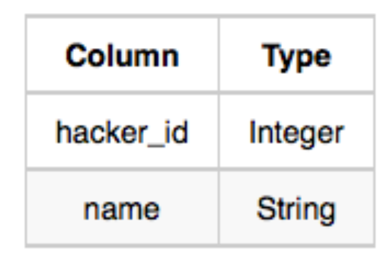
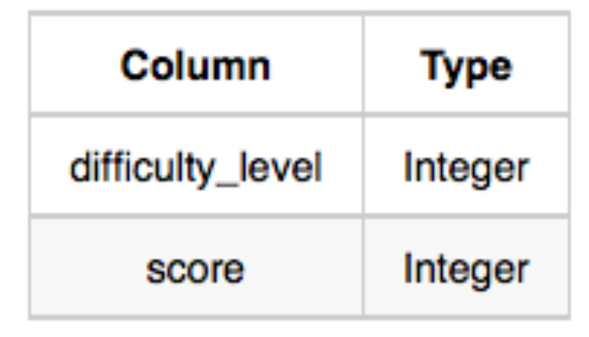
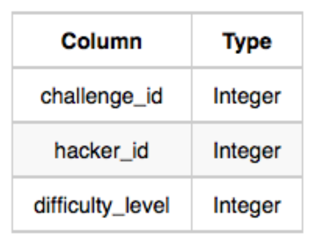
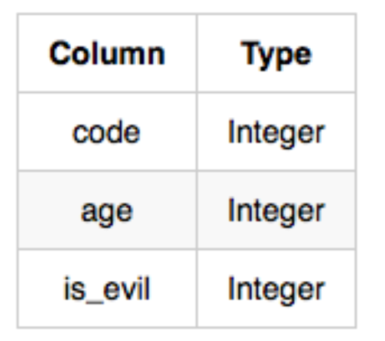
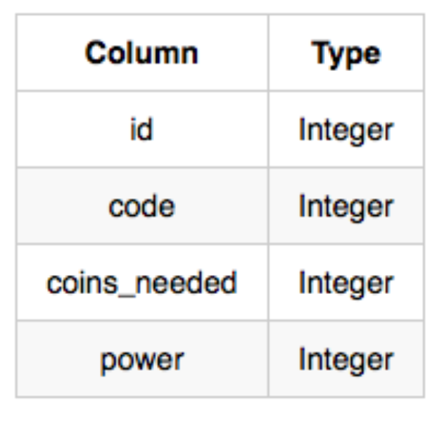

1.
Julia acabou de conduzir um concurso de codificação e precisa da sua ajuda para montar o placar! Escreva uma consulta para imprimir o hacker_id e o nome dos hackers que atingiram a pontuação máxima em mais de um desafio. Ordene sua saída em ordem decrescente pelo número total de desafios em que o hacker obteve a pontuação máxima. Se mais de um hacker recebeu a pontuação máxima no mesmo número de desafios, classifique-os por hacker_id crescente .

Formato de entrada
As tabelas a seguir contêm dados do concurso:
Hackers: O hacker_id é o id do hacker, e o name é o nome do hacker.

Difficulty: O difficult_level é o nível de dificuldade do desafio, e a pontuação é a pontuação máxima que pode ser alcançada para um desafio naquele nível de dificuldade.

Challenge: O challenge_id é o id do desafio, o hacker_id é o id do hacker que criou o desafio e o difficult_level é o nível de dificuldade do desafio.

Submissions : submission_id é o id do envio, hacker_id é o id do hacker que fez o envio, challenge_id é o id do desafio ao qual o envio pertence e score é a pontuação do envio.

2. 
Harry Potter e seus amigos estão na casa de Olivaras com Rony, finalmente substituindo a velha varinha quebrada de Charlie.
Hermione decide que a melhor maneira de escolher é determinando o número mínimo de galeões de ouro necessários para comprar cada varinha não maligna de alto poder e idade. Escreva uma consulta para imprimir o id , age , coins_needed e power das varinhas nas quais Ron está interessado, classificadas em ordem decrescente de power . Se mais de uma varinha tiver o mesmo poder, classifique o resultado em ordem decrescente de age .

Formato de entrada
As tabelas a seguir contêm dados sobre as varinhas no inventário de Olivaras:
Varinhas: O id é o id da varinha, o code é o código da varinha, coins_needed é o número total de galeões de ouro necessários para comprar a varinha e o power denota a qualidade da varinha (quanto maior o poder, melhor a varinha é).

Wands_Property: O código é o código da varinha, age é a idade da varinha e is_evil denota se a varinha é boa para as artes das trevas. Se o valor de is_evil for 0 , significa que a varinha não é má. O mapeamento entre code e age é um-um, o que significa que se houver dois pares, (code1, age1) e (code2, age2), então (code1 != code2) e (age1 != age2).

