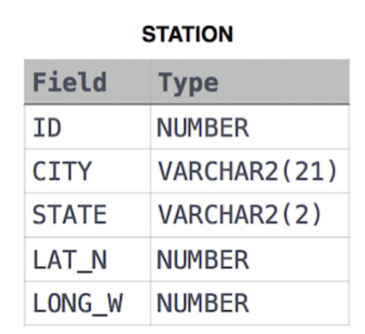

Challenge 1
=========================

Weather Observation Station 4 | HackerRank

1.
Encontre a diferença entre o número total de entradas CITY na tabela e o número de entradas CITY distintas na tabela.
A tabela STATION é descrita como segue:

onde LAT_N é a latitude norte e LONG_W é a longitude oeste.
Por exemplo, se houver três registros na tabela com valores CITY 'New York', 'New York', 'Bengalaru', há 2 nomes de cidades diferentes: 'New York' e 'Bengalaru'. A consulta retorna 1.

2.
Consulte as duas cidades em STATION com os nomes de CITY mais curtos e mais longos , bem como seus respectivos comprimentos (ou seja: número de caracteres no nome). Se houver mais de uma cidade menor ou maior, escolha a que vier primeiro quando ordenada alfabeticamente.
A tabela STATION é descrita da seguinte forma:

onde LAT_N é a latitude norte e LONG_W é a longitude oeste.

Entrada de amostra
Por exemplo, CITY tem quatro entradas: DEF, ABC, PQRS e WXY .

Saída de amostra
ABC 3
PQRS 4
Explicação

Quando ordenados alfabeticamente, os nomes das CIDADES são listados como ABC, DEF, PQRS e WXY , com comprimentose. O nome mais longo é PQRS , mas existemopções para a cidade com o nome mais curto. Escolha ABC , porque vem primeiro em ordem alfabética.

3.
Consulte a lista de nomes de CITY começando com vogais (ou seja, a, e, i, o, ou u) de STATION . Seu resultado não pode conter duplicatas.

Formato de entrada
A tabela STATION é descrita da seguinte forma:

onde LAT_N é a latitude norte e LONG_W é a longitude oeste.

4.
Consulte a lista de nomes de CITY terminando com vogais (ou seja, a, e, i, o, ou u) de STATION . Seu resultado não pode conter duplicatas.

Formato de entrada
A tabela STATION é descrita da seguinte forma:

onde LAT_N é a latitude norte e LONG_W é a longitude oeste.

5.
Consulte a lista de nomes de CITY de STATIOM que têm vogais (ou seja, a , e , i , o e u ) como primeiro e último caracteres. Seu resultado não pode conter duplicatas.

Formato de entrada
A tabela STATION é descrita da seguinte forma:

onde LAT_N é a latitude norte e LONG_W é a longitude oeste.

6.
Consulte a lista de nomes de CITY de STATION que não começam com vogais. Seu resultado não pode conter duplicatas.

Formato de entrada
A tabela STATION é descrita da seguinte forma:

onde LAT_N é a latitude norte e LONG_W é a longitude oeste.

7.
Consulte a lista de nomes de CITY de STATION que não terminam com vogais. Seu resultado não pode conter duplicatas.

Formato de entrada
A tabela STATION é descrita da seguinte forma:

onde LAT_N é a latitude norte e LONG_W é a longitude oeste.

8.
Consulte a lista de nomes de CITY de STATIOM que não começam ou nem terminam têm vogais (ou seja, a , e , i , o e u ). Seu resultado não pode conter duplicatas.

Formato de entrada
A tabela STATION é descrita da seguinte forma:

onde LAT_N é a latitude norte e LONG_W é a longitude oeste.

9.
Consulte a lista de nomes de CITY de STATIOM que não começam e nem terminam têm vogais (ou seja, a , e , i , o e u ). Seu resultado não pode conter duplicatas.

Formato de entrada
A tabela STATION é descrita da seguinte forma:

onde LAT_N é a latitude norte e LONG_W é a longitude oeste.
